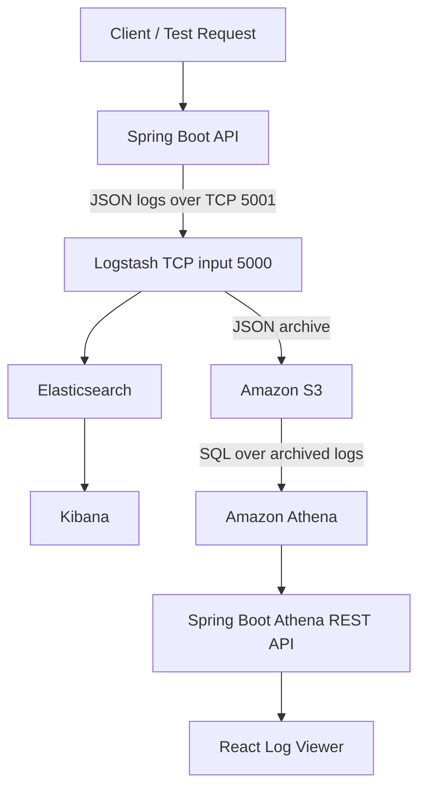

# Log Analytics Service

> Final implementation: Spring Boot 4, TCP-based Logstash ingestion, Elasticsearch/Kibana, S3/Athena, and React.

A locally runnable log-ingestion and analytics demonstration built with Java, Spring Boot, Logstash, Elasticsearch, Kibana, Amazon S3, Amazon Athena, and React.

The application generates structured operational logs, supports real-time investigation in Kibana, archives logs in Amazon S3, queries archived data through Athena, and exposes query results through a REST API for display in a React interface.

## Project status

| Capability | Status |
| --- | --- |
| Spring Boot application and health checks | Complete |
| Structured JSON logging | Complete |
| INFO, WARN, and ERROR log generation | Complete |
| Correlation ID and order ID enrichment with MDC | Complete |
| Logstash ingestion | Complete |
| Elasticsearch indexing | Complete |
| Kibana search and filtering | Complete |
| Amazon S3 archival | Complete |
| Amazon Athena queries | Complete |
| Athena REST API | Complete |
| React log viewer | Complete |

## Architecture



### Component responsibilities

| Component | Responsibility |
| --- | --- |
| Spring Boot | Provides the demonstration API and emits structured operational events |
| MDC | Adds `correlationId` and `orderId` to logs for request tracing |
| Logback TCP appender | Sends newline-delimited JSON events to host port `5001` |
| Logstash | Receives JSON on container port `5000`, enriches it, and forwards it to two outputs |
| Elasticsearch | Stores and indexes events for fast operational search |
| Kibana | Searches, filters, and visualizes Elasticsearch data |
| Amazon S3 | Provides durable archival storage for application logs |
| Amazon Athena | Runs SQL queries directly over archived S3 logs |
| Spring Boot Athena API | Starts Athena queries and returns normalized results |
| React | Displays and filters archived log-query results |

## Technology stack

- Java 21
- Spring Boot 4.x
- Maven
- SLF4J and Logback
- Docker Compose
- Logstash 9.5.3
- Elasticsearch 9.5.3
- Kibana 9.5.3
- Amazon S3 and Athena in `us-west-1` (N. California)
- AWS SDK for Java v2
- React with Vite

## Prerequisites

- JDK 21
- Docker Desktop with Docker Compose
- Maven, or the included Maven Wrapper
- Node.js LTS and npm for the React stage
- AWS account with least-privilege IAM credentials for S3, Athena, and Glue

Allocate at least 4 GB of memory to Docker Desktop for the Elastic stack.

## Project structure

```text
logAnalyticsService/
├── compose.yaml
├── logstash/
│   └── pipeline/
│       └── logstash.conf
├── logs/                       # Generated at runtime; excluded from Git
│   └── application.log
├── src/
│   ├── main/
│   │   ├── java/com/sravanthi/loganalytics/
│   │   │   ├── LogAnalyticsServiceApplication.java
│   │   │   ├── config/AthenaConfig.java
│   │   │   ├── controller/
│   │   │   │   ├── AthenaController.java
│   │   │   │   └── LogGeneratorController.java
│   │   │   └── service/AthenaQueryService.java
│   │   └── resources/
│   │       ├── application.properties
│   │       └── logback-spring.xml
│   └── test/
├── log-analytics-ui/          # React/Vite log-search interface
├── pom.xml
└── README.md
```

## Running locally

### 1. Start the Spring Boot application

On macOS or Linux:

```bash
./mvnw spring-boot:run
```

On Windows:

```powershell
mvnw.cmd spring-boot:run
```

Verify the application:

```bash
curl http://localhost:8080/actuator/health
```

Expected response:

```json
{"groups":["liveness","readiness"],"status":"UP"}
```

### 2. Generate representative log events

Normal request (`INFO`):

```bash
curl "http://localhost:8080/api/logs/generate?orderId=ORD-101&amount=250"
```

High-value request (`WARN`):

```bash
curl "http://localhost:8080/api/logs/generate?orderId=ORD-102&amount=7500"
```

Invalid request (`ERROR` and HTTP 400):

```bash
curl -i "http://localhost:8080/api/logs/generate?orderId=ORD-103&amount=-10"
```

The controller is a controlled demonstration utility. It simulates a small business workflow so that the observability pipeline receives realistic `INFO`, `WARN`, and `ERROR` events.

### 3. Inspect structured logs

```bash
tail -n 5 logs/application.log
```

Each line is one JSON event containing fields such as:

- `@timestamp`
- `level`
- `message`
- `logger_name`
- `thread_name`
- `orderId`
- `correlationId`

### 4. Start the Elastic stack

```bash
docker compose up -d
```

Check the containers:

```bash
docker compose ps
```

Verify Elasticsearch:

```bash
curl http://localhost:9200
```

Verify the application-log indices:

```bash
curl "http://localhost:9200/_cat/indices/application-logs-*?v"
```

The indices are created daily, for example:

```text
application-logs-2026.09.12
```

A `yellow` index health status is expected in this local single-node setup because the replica shard has no second Elasticsearch node. The primary shard remains available.

### 5. Search in Kibana

Open [http://localhost:5601](http://localhost:5601), then:

1. Open **Discover**.
2. Create a data view named **Application Logs**.
3. Use `application-logs-*` as the index pattern.
4. Select `@timestamp` as the timestamp field.
5. Set the time range to **Last 24 hours** and refresh.

Useful Kibana Query Language searches:

```text
level: "WARN"
```

```text
level: "ERROR"
```

```text
orderId: "ORD-102"
```

```text
correlationId: "<correlation-id>"
```

Recommended Discover columns are `@timestamp`, `level`, `message`, `orderId`, `correlationId`, and `application`.

## Logging configuration

`logback-spring.xml` uses `LogstashTcpSocketAppender` to serialize application events as JSON and send them to `localhost:5001`. Docker Compose maps host port `5001` to Logstash container port `5000`. A local rolling JSON file is retained for development diagnostics.

```xml
<appender name="LOGSTASH"
          class="net.logstash.logback.appender.LogstashTcpSocketAppender">
    <destination>localhost:5001</destination>
    <encoder class="net.logstash.logback.encoder.LogstashEncoder"/>
</appender>
```

The generated `logs/` directory and local AWS environment file are excluded from Git:

```gitignore
logs/
.env
```

## Logstash pipeline

The TCP input receives newline-delimited JSON from the Spring Boot Logback appender. Logstash sends every event to Elasticsearch for operational search and to S3 for historical analytics.

```conf
input {
  tcp {
    port => 5000
    codec => json_lines {
      ecs_compatibility => "disabled"
    }
  }
}

filter {
  mutate {
    add_field => {
      "application" => "log-analytics-service"
    }
  }
}

output {
  elasticsearch {
    hosts => ["http://elasticsearch:9200"]
    index => "application-logs-%{+YYYY.MM.dd}"
  }

  s3 {
    region => "us-west-1"
    bucket => "log-analytics-sravanthi-2026"
    prefix => "application-logs/year=%{+YYYY}/month=%{+MM}/day=%{+dd}/"
    rotation_strategy => "time"
    time_file => 1
    temporary_directory => "/usr/share/logstash/data/s3-temp"
    validate_credentials_on_root_bucket => false
    codec => json_lines
  }

  stdout {
    codec => rubydebug
  }
}
```

Using TCP avoids host/container file synchronization issues and more closely represents a stream-based production ingestion connector. Port `5001` is used on the host because port `5000` may already be occupied on macOS.

## Correlation and traceability

Every demonstration request receives a UUID correlation ID. `MDC` attaches both the correlation ID and order ID to every log event created during that synchronous request.

```java
MDC.put("correlationId", correlationId);
MDC.put("orderId", orderId);
```

MDC is cleared in a `finally` block because servlet-container threads are reused:

```java
finally {
    MDC.clear();
}
```

This enables end-to-end searches in Kibana, Athena, and React without passing diagnostic fields into every logging statement.

## S3 and Athena integration

One private S3 bucket in `us-west-1` uses separate prefixes for application-log archives and Athena query results:

```text
s3://log-analytics-sravanthi-2026/application-logs/year=YYYY/month=MM/day=DD/
s3://log-analytics-sravanthi-2026/athena-results/
```

The `log_analytics_db.application_logs` external table uses the AWS Glue Data Catalog and partition projection over the `year`, `month`, and `day` prefixes. The Java service uses AWS SDK for Java v2 to start an Athena query, poll its status, retrieve the result rows, and return them through:

```text
GET /api/athena/logs?year=2026&month=09&day=13&orderId=ORD-TCP-003
```

Local credentials are supplied through environment variables and are never stored in source code. A deployed application should use an IAM role with least-privilege access.

## React interface

The React application calls the Spring Boot Athena API and displays:

- Timestamp
- Log level
- Message
- Order ID
- Correlation ID
- Date-partition and order-ID search fields
- Loading, empty, and error states

Run the interface locally:

```bash
cd log-analytics-ui
npm install
npm run dev
```

Then open [http://localhost:5173](http://localhost:5173).

## Deployment approach

The current local deployment uses Docker Compose for the Elastic stack and the Maven Wrapper for Spring Boot. This makes the demonstration reproducible without separate Elasticsearch, Logstash, or Kibana installations.

For a production deployment:

- Package the Spring Boot service as a container.
- Run stateless application instances behind a load balancer.
- Use managed Elasticsearch/OpenSearch or an organization-standard observability platform.
- Archive logs in encrypted, private S3 storage with lifecycle policies.
- Assign IAM roles instead of static credentials.
- Limit Athena scan costs with partitions, compressed data, and workgroup controls.
- Restrict CORS, authenticate APIs, and protect management endpoints.

## Design decisions

### Why Kibana instead of Splunk?

The requirement permits either platform. Kibana was selected because Elasticsearch, Logstash, and Kibana can be reproduced locally with one Docker Compose workflow. It exposes the complete ingestion configuration and satisfies the real-time operational search requirement without requiring a separate hosted account. Splunk remains a strong enterprise option and would be reconsidered where an organization is already standardized on it.

### Why both Elasticsearch and S3/Athena?

- Elasticsearch and Kibana provide fast operational investigation over recent logs.
- S3 provides low-cost durable archival.
- Athena provides serverless SQL analytics over archived logs.

The two paths serve different access and retention needs rather than duplicating the same role.

### Why structured JSON?

Structured JSON makes diagnostic fields independently searchable and avoids relying on fragile regular-expression parsing. One event per line is suitable for Logstash ingestion and Athena JSON processing.

## Troubleshooting

### No `application-logs-*` index

Confirm that the host-side TCP port is reachable:

```bash
nc -zv localhost 5001
```

Inspect Logstash output:

```bash
docker compose logs --tail=100 logstash
```

Ensure `compose.yaml` maps the host and container ports:

```yaml
ports:
  - "5001:5000"
```

Ensure the Logstash input uses:

```conf
tcp {
  port => 5000
  codec => json_lines
}
```

Restart Spring Boot after Logstash is ready so the TCP appender connects cleanly.

### Athena REST API returns `TABLE_NOT_FOUND`

- Confirm Athena, S3, and the Spring Boot AWS client all use `us-west-1`.
- Run `SHOW TABLES IN log_analytics_db` in Athena.
- Verify that `log_analytics_db.application_logs` exists in the regional Glue Data Catalog.

### Athena REST API cannot load credentials

The `.env` file is loaded by Docker Compose but not automatically by IntelliJ. Add `AWS_ACCESS_KEY_ID`, `AWS_SECRET_ACCESS_KEY`, and `AWS_REGION` to the Spring Boot run configuration, or source `.env` before running the Maven Wrapper. Never commit or print credentials.

### Kibana shows no results

- Confirm `application-logs-*` exists in Elasticsearch.
- Select the `Application Logs` data view.
- Expand the Discover time range to the last 24 hours.
- Generate a fresh application event and refresh Discover.

### Stop the local stack

```bash
docker compose down
```

This retains named-volume data. The following command also removes stored local Elasticsearch and Logstash state and should only be used when a full reset is intended:

```bash
docker compose down -v
```

## Security notes

- S3 buckets remain private with public access blocked.
- AWS root credentials and permanent secrets are never committed.
- `.env`, IDE metadata, runtime logs, and credential files must be excluded from Git.
- Local Elastic security is disabled only to simplify this isolated demonstration; production environments require authentication, TLS, authorization, and secret management.
