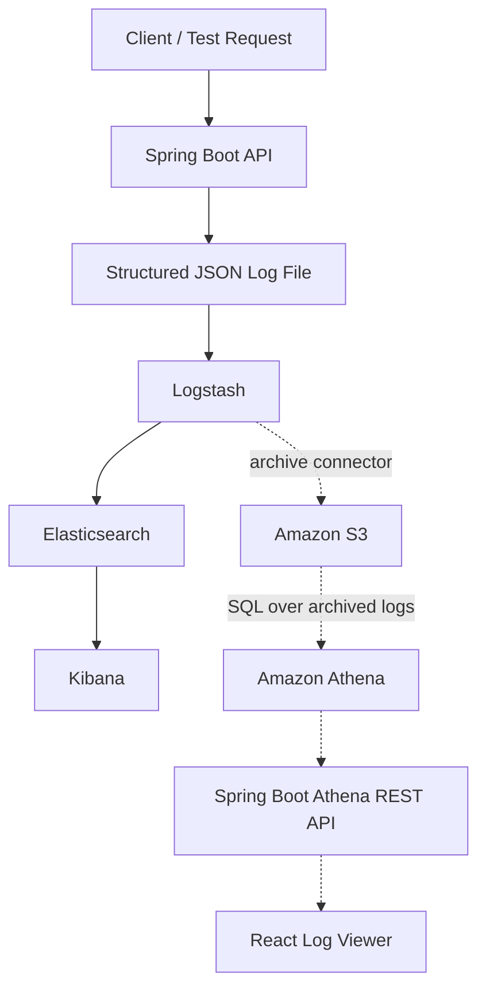

# Log Analytics Service

A locally runnable log-ingestion and analytics demonstration built with Java, Spring Boot, Logstash, Elasticsearch, Kibana, Amazon S3, Amazon Athena, and React.

The application generates structured operational logs, supports real-time investigation in Kibana, archives logs in Amazon S3, queries archived data through Athena, and exposes query results through a REST API for display in a React interface.

## Project status

| Capability | Status |
| --- | --- |
| Spring Boot application and health checks | Complete |
| Structured JSON file logging | Complete |
| INFO, WARN, and ERROR log generation | Complete |
| Correlation ID and order ID enrichment with MDC | Complete |
| Logstash ingestion | Complete |
| Elasticsearch indexing | Complete |
| Kibana search and filtering | Complete |
| Amazon S3 archival | Planned |
| Amazon Athena queries | Planned |
| Athena REST API | Planned |
| React log viewer | Planned |

## Architecture



Solid lines represent the currently implemented local pipeline. Dashed lines represent the planned cloud analytics and UI pipeline.

### Component responsibilities

| Component | Responsibility |
| --- | --- |
| Spring Boot | Provides the demonstration API and emits structured operational events |
| MDC | Adds `correlationId` and `orderId` to logs for request tracing |
| Log file | Stores newline-delimited JSON events locally |
| Logstash | Reads, parses, enriches, and forwards log events |
| Elasticsearch | Stores and indexes events for fast operational search |
| Kibana | Searches, filters, and visualizes Elasticsearch data |
| Amazon S3 | Provides durable archival storage for application logs |
| Amazon Athena | Runs SQL queries directly over archived S3 logs |
| Spring Boot Athena API | Starts Athena queries and returns normalized results |
| React | Displays and filters archived log-query results |

## Technology stack

- Java 21
- Spring Boot 3.5.x
- Maven
- SLF4J and Logback
- Docker Compose
- Logstash 9.5.3
- Elasticsearch 9.5.3
- Kibana 9.5.3
- Amazon S3 and Athena in `us-west-1` (N. California), planned
- AWS SDK for Java v2, planned
- React with Vite, planned

## Prerequisites

- JDK 21
- Docker Desktop with Docker Compose
- Maven, or the included Maven Wrapper
- Node.js LTS and npm for the React stage
- AWS account and AWS CLI v2 for the S3/Athena stage

Allocate at least 4 GB of memory to Docker Desktop for the Elastic stack.

## Project structure

```text
logAnalyticsService/
├── compose.yaml
├── logstash/
│   └── pipeline/
│       └── logstash.conf
├── logs/                       # Generated at runtime; excluded from Git
│   └── application.log
├── src/
│   ├── main/
│   │   ├── java/com/sravanthi/loganalytics/
│   │   │   ├── LogAnalyticsServiceApplication.java
│   │   │   └── controller/
│   │   │       └── LogGeneratorController.java
│   │   └── resources/
│   │       └── application.properties
│   └── test/
├── pom.xml
└── README.md
```

## Running locally

### 1. Start the Spring Boot application

On macOS or Linux:

```bash
./mvnw spring-boot:run
```

On Windows:

```powershell
mvnw.cmd spring-boot:run
```

Verify the application:

```bash
curl http://localhost:8080/actuator/health
```

Expected response:

```json
{"groups":["liveness","readiness"],"status":"UP"}
```

### 2. Generate representative log events

Normal request (`INFO`):

```bash
curl "http://localhost:8080/api/logs/generate?orderId=ORD-101&amount=250"
```

High-value request (`WARN`):

```bash
curl "http://localhost:8080/api/logs/generate?orderId=ORD-102&amount=7500"
```

Invalid request (`ERROR` and HTTP 400):

```bash
curl -i "http://localhost:8080/api/logs/generate?orderId=ORD-103&amount=-10"
```

The controller is a controlled demonstration utility. It simulates a small business workflow so that the observability pipeline receives realistic `INFO`, `WARN`, and `ERROR` events.

### 3. Inspect structured logs

```bash
tail -n 5 logs/application.log
```

Each line is one JSON event containing fields such as:

- `@timestamp`
- `level`
- `message`
- `logger_name`
- `thread_name`
- `orderId`
- `correlationId`

### 4. Start the Elastic stack

```bash
docker compose up -d
```

Check the containers:

```bash
docker compose ps
```

Verify Elasticsearch:

```bash
curl http://localhost:9200
```

Verify the application-log indices:

```bash
curl "http://localhost:9200/_cat/indices/application-logs-*?v"
```

The indices are created daily, for example:

```text
application-logs-2026.09.12
```

A `yellow` index health status is expected in this local single-node setup because the replica shard has no second Elasticsearch node. The primary shard remains available.

### 5. Search in Kibana

Open [http://localhost:5601](http://localhost:5601), then:

1. Open **Discover**.
2. Create a data view named **Application Logs**.
3. Use `application-logs-*` as the index pattern.
4. Select `@timestamp` as the timestamp field.
5. Set the time range to **Last 24 hours** and refresh.

Useful Kibana Query Language searches:

```text
level: "WARN"
```

```text
level: "ERROR"
```

```text
orderId: "ORD-102"
```

```text
correlationId: "<correlation-id>"
```

Recommended Discover columns are `@timestamp`, `level`, `message`, `orderId`, `correlationId`, and `application`.

## Logging configuration

Spring Boot writes human-readable console output and structured Logstash JSON to `logs/application.log`:

```properties
spring.application.name=log-analytics-service
logging.file.name=logs/application.log
logging.structured.format.file=logstash
logging.logback.rollingpolicy.max-file-size=10MB
logging.logback.rollingpolicy.max-history=7
management.endpoints.web.exposure.include=health,info
```

The generated `logs/` directory should be excluded from Git:

```gitignore
logs/
```

## Logstash pipeline

The file input already emits one event per line, so it uses the `json` codec rather than `json_lines`.

```conf
input {
  file {
    path => "/usr/share/logstash/app-logs/application.log"
    start_position => "beginning"
    sincedb_path => "/dev/null"
    stat_interval => "1 second"

    codec => json {
      ecs_compatibility => "disabled"
    }
  }
}

filter {
  mutate {
    add_field => {
      "application" => "log-analytics-service"
    }
  }
}

output {
  elasticsearch {
    hosts => ["http://elasticsearch:9200"]
    index => "application-logs-%{+YYYY.MM.dd}"
  }

  stdout {
    codec => rubydebug
  }
}
```

`sincedb_path => "/dev/null"` is used only for the current demonstration workflow so a fresh Logstash container can reread the local file. A production deployment should persist `sincedb` state or use an agent/stream-based ingestion mechanism to prevent replay after restarts.

## Correlation and traceability

Every demonstration request receives a UUID correlation ID. `MDC` attaches both the correlation ID and order ID to every log event created during that synchronous request.

```java
MDC.put("correlationId", correlationId);
MDC.put("orderId", orderId);
```

MDC is cleared in a `finally` block because servlet-container threads are reused:

```java
finally {
    MDC.clear();
}
```

This enables end-to-end searches in Kibana and, later, Athena and React without passing diagnostic fields into every logging statement.

## Planned S3 and Athena integration

The cloud stage will use two private, encrypted S3 locations in `us-west-1`:

- Application-log archive
- Athena query results

Athena will use the AWS Glue Data Catalog to define the JSON log schema. The Java service will use AWS SDK for Java v2 to start an Athena query, poll its execution status, retrieve results, and expose normalized log records through a REST endpoint.

Planned API:

```text
GET /api/analytics/logs?level=ERROR&limit=100
```

Credentials will not be stored in source code. Local development will use an AWS CLI profile or temporary credentials, while a deployed application should use an IAM role with least-privilege access.

## Planned React interface

The React application will call the Spring Boot Athena API and display:

- Timestamp
- Log level
- Message
- Order ID
- Correlation ID
- Filters for level and search text
- Loading, empty, and error states

## Deployment approach

The current local deployment uses Docker Compose for the Elastic stack and the Maven Wrapper for Spring Boot. This makes the demonstration reproducible without separate Elasticsearch, Logstash, or Kibana installations.

For a production deployment:

- Package the Spring Boot service as a container.
- Run stateless application instances behind a load balancer.
- Use managed Elasticsearch/OpenSearch or an organization-standard observability platform.
- Archive logs in encrypted, private S3 storage with lifecycle policies.
- Assign IAM roles instead of static credentials.
- Limit Athena scan costs with partitions, compressed data, and workgroup controls.
- Restrict CORS, authenticate APIs, and protect management endpoints.

## Design decisions

### Why Kibana instead of Splunk?

The requirement permits either platform. Kibana was selected because Elasticsearch, Logstash, and Kibana can be reproduced locally with one Docker Compose workflow. It exposes the complete ingestion configuration and satisfies the real-time operational search requirement without requiring a separate hosted account. Splunk remains a strong enterprise option and would be reconsidered where an organization is already standardized on it.

### Why both Elasticsearch and S3/Athena?

- Elasticsearch and Kibana provide fast operational investigation over recent logs.
- S3 provides low-cost durable archival.
- Athena provides serverless SQL analytics over archived logs.

The two paths serve different access and retention needs rather than duplicating the same role.

### Why structured JSON?

Structured JSON makes diagnostic fields independently searchable and avoids relying on fragile regular-expression parsing. One event per line is suitable for Logstash ingestion and Athena JSON processing.

## Troubleshooting

### No `application-logs-*` index

Confirm that Logstash can see the mounted file:

```bash
docker compose exec logstash ls -la /usr/share/logstash/app-logs
```

Inspect Logstash output:

```bash
docker compose logs --tail=100 logstash
```

Ensure the file input uses:

```conf
codec => json
```

Do not use `json_lines` with the line-oriented file input.

### Kibana shows no results

- Confirm `application-logs-*` exists in Elasticsearch.
- Select the `Application Logs` data view.
- Expand the Discover time range to the last 24 hours.
- Generate a fresh application event and refresh Discover.

### Stop the local stack

```bash
docker compose down
```

This retains named-volume data. The following command also removes stored local Elasticsearch and Logstash state and should only be used when a full reset is intended:

```bash
docker compose down -v
```

## Security notes

- S3 buckets remain private with public access blocked.
- AWS root credentials and permanent secrets are never committed.
- `.env`, IDE metadata, runtime logs, and credential files must be excluded from Git.
- Local Elastic security is disabled only to simplify this isolated demonstration; production environments require authentication, TLS, authorization, and secret management.

